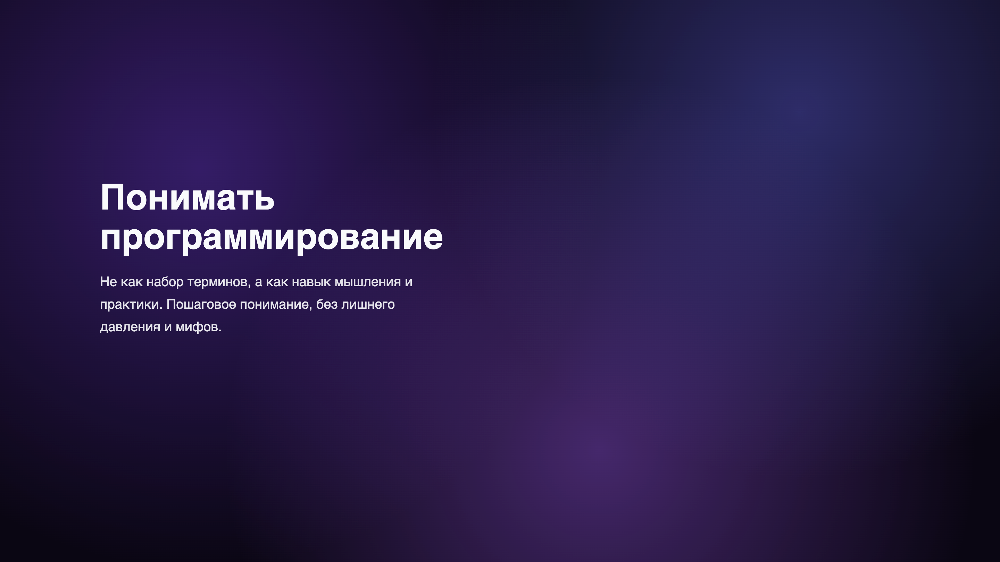
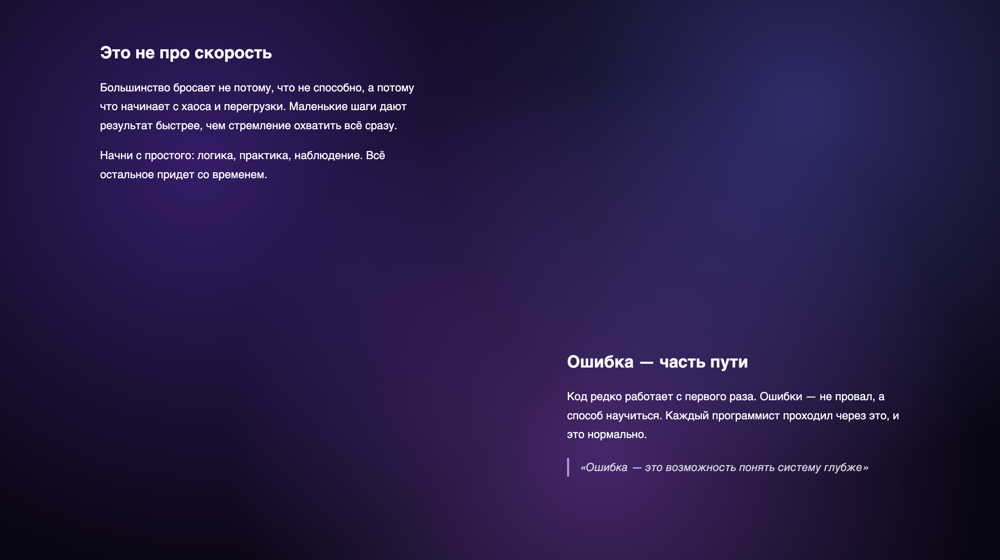
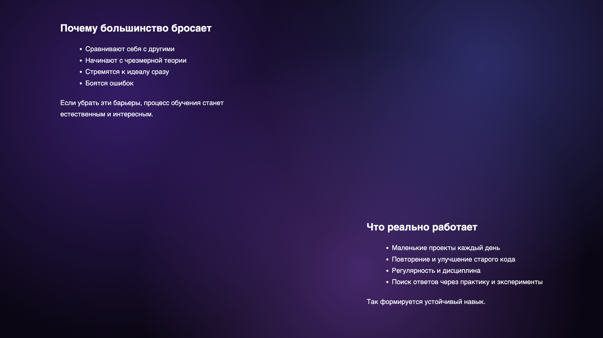
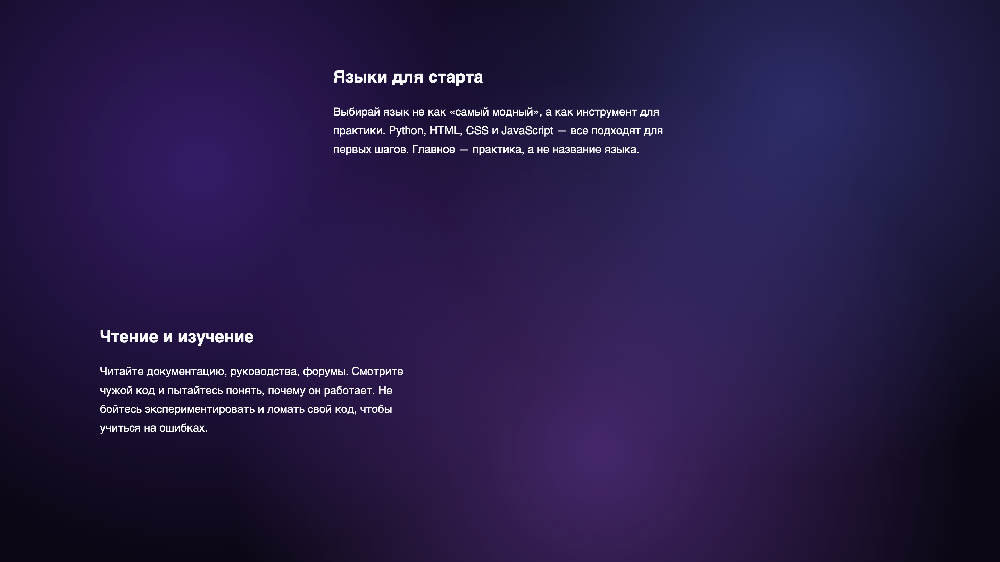

# Понимать программирование

Это экспериментальный веб-проект, созданный для демонстрации **современного текстового сайта**, который объясняет программирование доступно и понятно.  
Сайт выполнен в стиле **modern editorial / creative web**: асимметрия, визуальные акценты, плавная типографика и адаптация под мобильные устройства.

 
 
 
 

## 🧩 Особенности проекта

- Асимметричная композиция и современная типографика
- Адаптация для мобильных устройств
- Плавные переходы и визуальная иерархия текста
- Живой фон с градиентами и точечным шумом
- Заполненное пространство текстом, логично структурированное
- Простая структура: HTML + CSS, без JavaScript

## 🚀 Как запустить

1. Клонируйте репозиторий:
```bash
git clone https://github.com/MIGHOST935/Portfolio.git
